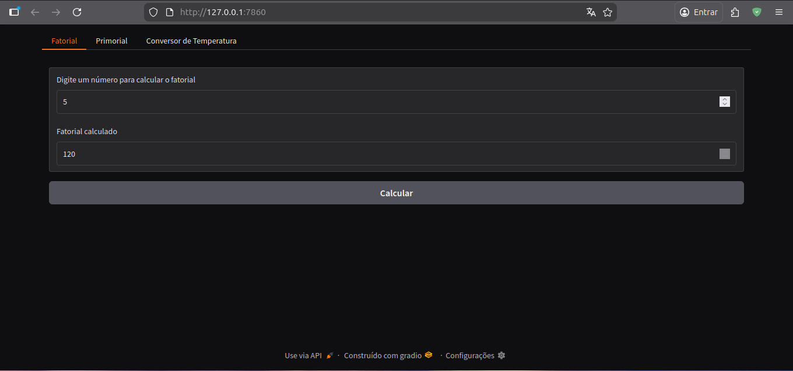
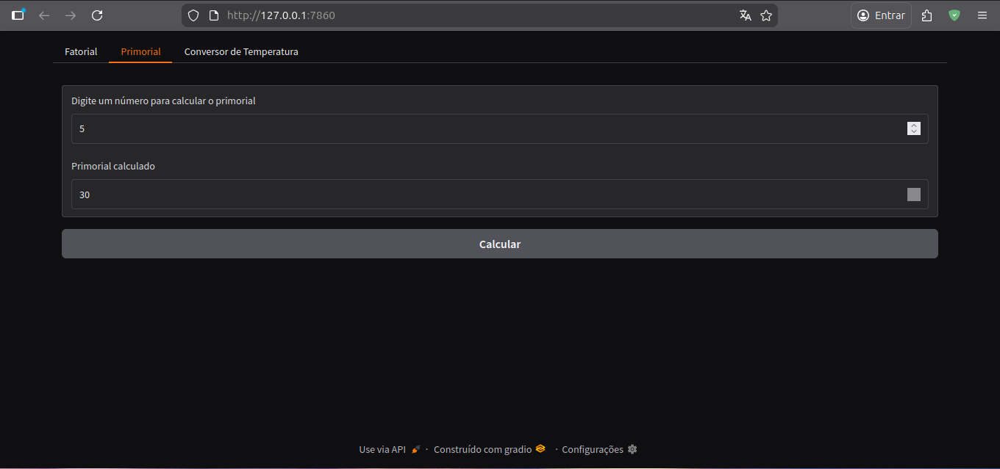
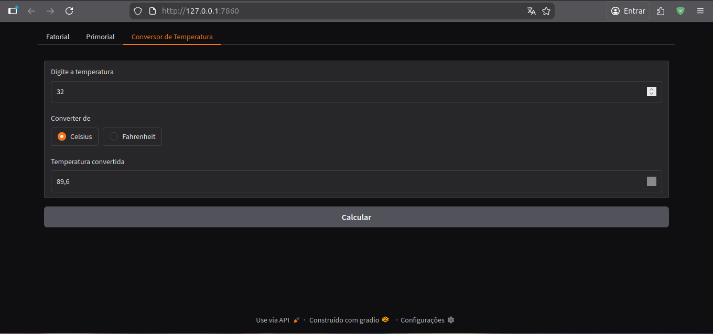

# Math Apps with Gradio

A simple web application built with Python and Gradio that provides mathematical utilities such as Factorial and Primorial calculations, as well as a Temperature Converter.

## 🚀 Technologies Used

- **Python**: Core programming language.
- **Gradio**: Library for creating web interfaces for machine learning and data science projects.
- **SymPy**: Library for symbolic mathematics (used for calculating primorials).

## 📁 Project Structure

```text
.
├── app.py              # Main application file
├── functions.py        # Mathematical logic and conversion functions
├── requirements.txt    # Project dependencies
└── README.md           # Project documentation
```

## ⚙️ How to Run

Follow these steps to run the project locally:

1. **Clone the repository**:

   ```bash
   git clone <repository-url>
   cd project-python-gradio-math-apps
   ```

2. **Create a virtual environment** (optional but recommended):

   ```bash
   python -m venv .venv
   source .venv/bin/activate  # On Windows: .venv\Scripts\activate
   ```

3. **Install dependencies**:

   ```bash
   pip install -r requirements.txt
   ```

4. **Run the application**:

   ```bash
   python app.py
   ```

The application will be available at `http://127.0.0.1:7860`.

## 🧪 Mathematical Formulas

### Factorial ($n!$)

The product of all positive integers less than or equal to $n$.
**Example:**
$5! = 5 \times 4 \times 3 \times 2 \times 1 = 120$

### Primorial

The product of all prime numbers less than or equal to $n$.
**Example:**
$5 primorial = 5 \times 3 \times 2 = 30$

### Temperature Conversion

- **Celsius to Fahrenheit**:
  $F = (C \times 9/5) + 32$
- **Fahrenheit to Celsius**:
  $C = (F - 32) \times 5/9$

## 🖼️ Previews




